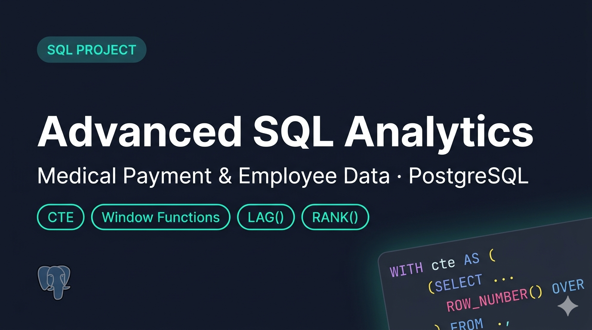

# 🏥 Advanced SQL Analytics — Medical Payment & Employee Data

> **PostgreSQL** | Window Functions | CTEs | Aggregations | Date Functions


---

## 📌 Project Overview

This project demonstrates advanced SQL querying on a healthcare company's **Employee** and **Medical Payment** datasets. The queries solve real-world business problems including remittance analysis, salary ranking, month-over-month trend analysis, and top-performer identification.

---

## 🧠 Skills This Project Demonstrates

| Skill | Description |
|---|---|
| 🟢 Window Functions | `ROW_NUMBER()`, `RANK()`, `LAG()` |
| 🟢 CTEs | Modular query design with `WITH` clause |
| 🟢 Conditional Aggregation | `CASE WHEN` inside `SUM()` |
| 🟡 Date Extraction | `EXTRACT(year/month FROM date)` |
| 🟡 Joins | `INNER JOIN` across employee & payment tables |
| 🟡 Grouping & Filtering | `GROUP BY`, `HAVING`, `WHERE` |

---

## 🛠️ Tools Used

- **Database:** PostgreSQL
- **Concepts:** Window Functions, CTEs, Aggregations, Date Functions
- **Domain:** Healthcare — Medical Billing & Payroll

---

## 📂 Dataset

### 👤 Employee Table

> Employees of **Radiant Data System Ltd**

| Column | Description |
|---|---|
| `Account Key` | Employee ID (Primary Key) |
| `Designation` | Job title (Manager, Analyst, Developer, etc.) |
| `Department` | Department name |
| `Salary` | Employee salary |
| `Manager ID` | Account Key of the reporting manager |

**Sample Data (5 rows):**

| Account Key | Designation | Department | Salary | Manager ID |
|---|---|---|---|---|
| ACC00001 | Manager | Sales | 110366.80 | — |
| ACC00002 | Manager | IT | 91133.21 | — |
| ACC00004 | Developer | Operations | 95190.41 | ACC00016 |
| ACC00005 | Director | HR | 169245.70 | ACC00885 |
| ACC00008 | Analyst | IT | 68540.97 | ACC00971 |

---

### 💳 Payment Table

> Medical payment records linked to employees

| Column | Description |
|---|---|
| `Service Date` | Date the service was provided |
| `Posting Date` | Date the record was posted |
| `Account Key` | Employee ID (Foreign Key → Employee) |
| `Charge Key` | Unique charge identifier |
| `CPT Code` | Medical procedure code |
| `Transaction Amount` | Amount transacted |
| `Allowed Amount` | Maximum allowed amount |
| `Remit Class` | Type: `Cash`, `Marker`, `Denial` |
| `CARC Code` | Claim Adjustment Reason Code |

**Sample Data (5 rows):**

| Posting Date | Account Key | Transaction Amount | Allowed Amount | Remit Class | CARC Code |
|---|---|---|---|---|---|
| 5/9/2023 | ACC00001 | $0.00 | $0.00 | Denial | DEN06 |
| 6/29/2022 | ACC00001 | $0.00 | $0.00 | Marker | MAR08 |
| 9/8/2023 | ACC00002 | $0.00 | $0.00 | Marker | MAR15 |
| 9/11/2022 | ACC00001 | $4032.30 | $280.47 | Cash | PA |
| 10/8/2022 | ACC00001 | $-160.81 | $547.85 | Cash | PA |

> 🟢 **Business Rule:** Transaction Amount must never be negative or exceed Allowed Amount. If it exceeds, cap it at **80% of Allowed Amount**.

---

## ❓ Questions & Solutions

---

## Question 1 — Most Frequent CARC Code for "Marker" Remit Class

### 🔹 Problem Statement
Find which **CARC Code** appears most often under `Remit Class = 'Marker'`, and identify **which employee** used it the most — including their Designation and Department.

### 🔹 Sample Output

| CARC Code | Account Key | Designation | Department | count |
|---|---|---|---|---|
| MARXX | ACCXXX | XXXX | XXXX | XXX |

### 🔹 Concept Used
- `INNER JOIN` to link payment and employee
- `WHERE` filter on Remit Class
- `GROUP BY` on multiple columns
- `ORDER BY COUNT(*) DESC` + `LIMIT 1` to get the top result

### 🔹 SQL Solution

```sql
SELECT
    p."CARC Code",
    p."Account Key",
    e."Designation",
    e."Department",
    COUNT(*) AS count
FROM employee e
INNER JOIN payment p
    ON e."Account Key" = p."Account Key"
WHERE p."Remit Class" = 'Marker'
GROUP BY
    p."CARC Code",
    p."Account Key",
    e."Designation",
    e."Department"
ORDER BY count DESC
LIMIT 1;
```

### 🔹 Logic Explanation
Filter payments to `Marker` class only, then group by CARC Code + employee details to count occurrences. `ORDER BY COUNT DESC LIMIT 1` picks the single highest combination.

---

## Question 2 — Most Frequent CARC Code for "Denial" Remit Class

### 🔹 Problem Statement
Same logic as Q1 but for `Remit Class = 'Denial'` — find the most used CARC Code and the employee behind it.

### 🔹 Sample Output

| CARC Code | Account Key | Designation | Department | count |
|---|---|---|---|---|
| DENXX | ACCXXX | XXXX | XXXX | XXX |

### 🔹 Concept Used
- Same pattern as Q1 — JOIN, GROUP BY, COUNT, LIMIT 1
- Only the `WHERE` filter changes

### 🔹 SQL Solution

```sql
SELECT
    p."CARC Code",
    p."Account Key",
    e."Designation",
    e."Department",
    COUNT(*) AS count
FROM payment p
INNER JOIN employee e
    ON p."Account Key" = e."Account Key"
WHERE p."Remit Class" = 'Denial'
GROUP BY
    p."CARC Code",
    p."Account Key",
    e."Designation",
    e."Department"
ORDER BY count DESC
LIMIT 1;
```

### 🔹 Logic Explanation
Identical structure to Q1. The only change is the `WHERE` clause — filtering for `'Denial'` instead of `'Marker'`. This is a common pattern interviewers use to test whether you can reuse query patterns cleanly.

---

## Question 3 — Top 2 Salaries per Department

### 🔹 Problem Statement
Find the **top 2 highest-paid employees** within each department.

### 🔹 Sample Output

| Account Key | Designation | Department | Salary | Manager ID | rank |
|---|---|---|---|---|---|
| ACC00XXX | Director | Finance | XXXXXX | XXXXXXX | 1 |
| ACC00XXX | Manager | Finance | XXXXXX | XXXXXXX | 2 |
| ACC00XXX | Director | HR | XXXXXX | XXXXXXX | 1 |

### 🔹 Concept Used
- 🟢 **Window Function:** `ROW_NUMBER() OVER(PARTITION BY ... ORDER BY ...)`
- **CTE** to compute ranks, then filter in outer query
- `PARTITION BY Department` resets rank for each department

### 🔹 SQL Solution

```sql
WITH cte AS (
    SELECT
        e."Account Key",
        e."Designation",
        e."Department",
        e."Salary",
        e."Manager ID",
        ROW_NUMBER() OVER (
            PARTITION BY e."Department"
            ORDER BY e."Salary" DESC
        ) AS ranks
    FROM employee e
)
SELECT *
FROM cte
WHERE ranks < 3;
```

### 🔹 Logic Explanation
`ROW_NUMBER()` assigns a sequential rank within each department ordered by salary descending. The CTE wraps this logic, and the outer query filters `ranks < 3` (rank 1 and 2 only). Using `ranks < 3` instead of `ranks <= 2` is equivalent but a clean pattern to remember.

> 🟡 **Note:** `ROW_NUMBER()` gives unique ranks even for ties. Use `RANK()` if you want tied employees to share the same rank.

---

## Question 4 — Month-over-Month % Change in Transaction Amount

### 🔹 Problem Statement
Calculate the **modified Transaction Amount** per month (applying business rules), then compute the **percentage increase** compared to the previous month.

### 🔹 Sample Output

| posting year | posting month | Mod Transaction Amount | Prev Month Amount | % Increase |
|---|---|---|---|---|
| 2022 | 1 | XXXXX.xx | XXXXX.xx | XX.xx |
| 2022 | 2 | XXXXX.xx | XXXXX.xx | XX.xx |

### 🔹 Concept Used
- 🟢 **Window Function:** `LAG()` to fetch the previous row's value
- **CTE** to first compute modified amounts, then apply LAG in outer query
- `CASE WHEN` for business rule enforcement
- `EXTRACT()` for year/month from date
- `ROUND()` for clean decimal output

### 🔹 SQL Solution

```sql
WITH cte AS (
    SELECT
        EXTRACT(YEAR  FROM p."Posting Date"::DATE) AS "posting year",
        EXTRACT(MONTH FROM p."Posting Date"::DATE) AS "posting month",
        ROUND(
            SUM(
                CASE
                    WHEN p."Transaction Amount" <= 0                        THEN 0
                    WHEN p."Transaction Amount" > p."Allowed Amount"        THEN p."Allowed Amount" * 0.8
                    ELSE p."Transaction Amount"
                END
            )::NUMERIC, 2
        ) AS mod_trans_amount
    FROM payment p
    GROUP BY "posting year", "posting month"
)
SELECT
    cte."posting year",
    cte."posting month",
    cte.mod_trans_amount,
    LAG(cte.mod_trans_amount, 1, 0) OVER (
        ORDER BY cte."posting year", cte."posting month"
    ) AS prev_mod_trans_amount,
    CASE
        WHEN LAG(cte.mod_trans_amount, 1, 0) OVER (
                ORDER BY cte."posting year", cte."posting month"
             ) = 0 THEN 0
        ELSE ROUND(
            (
                (cte.mod_trans_amount - LAG(cte.mod_trans_amount, 1, 0) OVER (
                    ORDER BY cte."posting year", cte."posting month"
                ))
                / LAG(cte.mod_trans_amount, 1, 0) OVER (
                    ORDER BY cte."posting year", cte."posting month"
                ) * 100
            )::NUMERIC, 2
        )
    END AS percent_increase
FROM cte;
```

### 🔹 Logic Explanation
**Step 1 (CTE):** Apply the business rules via `CASE WHEN` inside `SUM()`, grouped by year and month.
**Step 2 (Outer query):** Use `LAG(..., 1, 0)` to pull the previous month's amount. The default value `0` prevents NULL on the first row. Divide the difference by the previous amount × 100 for percentage. Guard against division by zero with the `CASE WHEN = 0 THEN 0` check.

> 🟢 **Interview Tip:** `LAG(col, 1, 0)` — the third argument is the default when there's no previous row. Always use it to avoid NULLs in the first row.

---

## Question 5 — Top Employee by Payment Amount Each Month

### 🔹 Problem Statement
For each month, find the **employee with the highest modified Transaction Amount**, along with their designation, department, and manager.

### 🔹 Sample Output

| Account Key | posting year | posting month | Mod Transaction Amount | rank | Designation | Department | Manager ID |
|---|---|---|---|---|---|---|---|
| ACC00XXX | 2023 | 4 | XXX.xx | 1 | Developer | HR | ACC00XXX |

### 🔹 Concept Used
- 🟢 **Window Function:** `RANK() OVER(PARTITION BY year, month ORDER BY amount DESC)`
- **CTE** combining payment + employee with `INNER JOIN`
- Same business rule `CASE WHEN` applied inside `SUM()`
- Filtering `rank <= 1` in the outer query

### 🔹 SQL Solution

```sql
WITH cte AS (
    SELECT
        p."Account Key",
        EXTRACT(YEAR  FROM p."Posting Date"::DATE) AS "posting year",
        EXTRACT(MONTH FROM p."Posting Date"::DATE) AS "posting month",
        ROUND(
            SUM(
                CASE
                    WHEN p."Transaction Amount" <= 0                  THEN 0
                    WHEN p."Transaction Amount" > p."Allowed Amount"  THEN p."Allowed Amount" * 0.8
                    ELSE p."Transaction Amount"
                END
            )::NUMERIC, 2
        ) AS mod_trans_amount,
        RANK() OVER (
            PARTITION BY
                EXTRACT(YEAR  FROM p."Posting Date"::DATE),
                EXTRACT(MONTH FROM p."Posting Date"::DATE)
            ORDER BY
                ROUND(
                    SUM(
                        CASE
                            WHEN p."Transaction Amount" <= 0                  THEN 0
                            WHEN p."Transaction Amount" > p."Allowed Amount"  THEN p."Allowed Amount" * 0.8
                            ELSE p."Transaction Amount"
                        END
                    )::NUMERIC, 2
                ) DESC
        ) AS rank,
        e."Designation",
        e."Department",
        e."Manager ID"
    FROM payment p
    INNER JOIN employee e
        ON p."Account Key" = e."Account Key"
    GROUP BY
        p."Account Key",
        e."Department",
        e."Designation",
        e."Manager ID",
        "posting year",
        "posting month"
)
SELECT *
FROM cte
WHERE rank <= 1
ORDER BY cte."posting year", cte."posting month";
```

### 🔹 Logic Explanation
The CTE joins payment and employee tables, applies the business rule, and assigns a `RANK()` partitioned by year-month. `RANK()` (not `ROW_NUMBER()`) is used so tied employees in the same month both appear. The outer query filters to rank 1 only and orders results chronologically.

> 🟡 **Note:** The `RANK()` expression must repeat the full `SUM(CASE WHEN ...)` because window functions cannot reference aliases defined in the same `SELECT` level.

---

## 🔑 Key SQL Techniques Used

| Technique | Used In |
|---|---|
| `ROW_NUMBER()` with `PARTITION BY` | Q3 |
| `RANK()` with `PARTITION BY` | Q5 |
| `LAG()` for previous row access | Q4 |
| CTE (`WITH` clause) | Q3, Q4, Q5 |
| `CASE WHEN` inside aggregate | Q4, Q5 |
| `EXTRACT(year/month FROM date)` | Q4, Q5 |
| `INNER JOIN` across tables | Q1, Q2, Q5 |
| `GROUP BY` + `COUNT / SUM` | All |
| `ORDER BY` + `LIMIT` for top-N | Q1, Q2 |

---

## 🎯 Common Interview Tricks from These Questions

> 🟢 **ROUND() requires `::NUMERIC` typecast in PostgreSQL:** `SUM()` on a numeric column returns `float8` by default. `ROUND()` does not accept `float8` — it will throw a type error. Always cast first:
> ```sql
> ROUND( SUM(...)::NUMERIC, 2 )   ✅
> ROUND( SUM(...), 2 )            ❌ -- type error in PostgreSQL
> ```

> 🟢 **Date casting before EXTRACT:** If a date column is stored as `TEXT` or `VARCHAR`, cast it before extracting:
> ```sql
> EXTRACT(YEAR FROM "Posting Date"::DATE)
> ```
> Without `::DATE`, `EXTRACT()` may error or return unexpected results.

> 🟢 **Window vs Aggregate:** Window functions don't collapse rows — you can use both in the same query with a CTE.

> 🟢 **LAG default value:** Always pass a third argument to `LAG()` to handle the first row gracefully — `LAG(col, 1, 0)`. Without it, the first row returns `NULL`, which breaks any arithmetic on it.

> 🟢 **ROW_NUMBER vs RANK vs DENSE_RANK:**
> - `ROW_NUMBER()` → always unique, even for ties (1, 2, 3...)
> - `RANK()` → ties share the same rank, next rank skips (1, 1, 3...)
> - `DENSE_RANK()` → ties share rank, no gaps (1, 1, 2...)

> 🟢 **Division by zero:** Always guard percentage calculations with a `CASE WHEN divisor = 0 THEN 0`. Skipping this causes a **runtime error**, not just a NULL.

> 🟡 **LIMIT 1 pattern:** Combining `GROUP BY + ORDER BY COUNT(*) DESC + LIMIT 1` is the fastest way to get the single top record without any window function.

> 🟡 **Business rule in SQL:** Embed data validation directly in `CASE WHEN` inside aggregates — keeps the logic close to the data and avoids pre-processing.

> 🟡 **Alias in window function:** You cannot reference a `SELECT`-level alias inside a `WINDOW` or `ORDER BY` in the same query level. Wrap in a CTE first — then the alias is available to the outer query.

> 🟡 **WHERE on window function result:** You cannot filter on a window function result (e.g., `WHERE rank <= 1`) in the same `SELECT` where it is computed. Always wrap in a CTE or subquery first.

---

*Built with PostgreSQL | Dataset: Custom*
